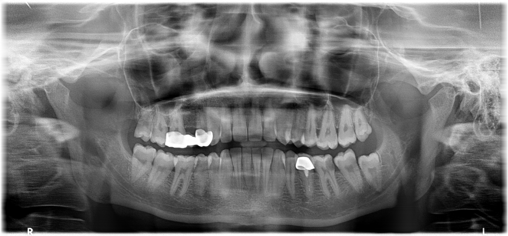

# Introduction and Literature Review

Dental disease is one of the most common chronic conditions worldwide, and panoramic radiography is the standard first-line imaging technique used to screen for it (Peres et al. 2019). A single panoramic X-ray typically contains 28 to 32 teeth, and clinicians must assess each of them individually for decay, periapical lesions, and other abnormalities. The task is repetitive, and the volume of panoramic X-rays taken in routine care is substantial. These two features together make panoramic-X-ray reading a natural target for automation.

Modern object-detection models have made rapid progress on this kind of problem. The YOLO family in particular has become the default baseline for medical-image detection because it is fast, well supported in open-source tooling, and produces both bounding-box and polygon-mask outputs in a single pass (Jocher et al. 2023). Recent work in dentistry has applied YOLO-family detectors to caries detection, periapical-lesion detection, and tooth-numbering tasks on both bitewing and panoramic X-rays (Hamamci et al. 2023a). A recurring concern is that dental disease classes are heavily imbalanced in naturally occurring data, and that fully labeled panoramic-X-ray datasets remain small.

The DENTEX 2023 benchmark, released as part of the MICCAI 2023 challenge (Hamamci et al. 2023a, Hamamci et al. 2023b), was designed in part to address this data-scarcity problem by providing annotations at three levels of detail. The release includes 693 X-rays labeled at the quadrant level only, 634 X-rays labeled with quadrant plus tooth position within the quadrant, and 705 X-rays labeled with full diagnosis codes. The coarser labels encode useful structure. A model that first learns to localize quadrants should have an easier time learning tooth positions, and a model that has learned tooth positions should be better placed to assign disease classes to the correct tooth. The general idea that easier-to-harder tasks can improve a model's final performance has a long history in machine learning, going back to the original formulation of curriculum learning (Bengio et al. 2009).

Two concerns naturally follow. First, whether an easy-to-hard curriculum on DENTEX actually improves disease-level detection compared with a matched single-stage baseline that uses the fully labeled tier alone. If the extra supervision in the first two stages does not carry classification power to the final task, then the additional labeled images are not functioning as a useful prior, and the curriculum is largely overhead. Second, whether the curriculum's contribution is concentrated in a particular stage. If most of the useful representation is learned in the quadrant stage for example, that has different implications for dataset design than if most of it is learned in the enumeration stage.

This paper addresses those concerns directly. We train a three-stage curriculum YOLOv8m segmentation model on the DENTEX 2023 release and compare it, under matched hyperparameters, with a single-stage baseline trained only on the fully labeled tier. We also examine the checkpoints produced at each stage of the curriculum to isolate which stage contributes the most to the final model. A parallel track of the project evaluates how the resulting model behaves under realistic image degradation and across different scales of anatomical input.

The four research questions are as follows.

1. *RQ1.* Does a three-stage curriculum (quadrant, enumeration, diagnosis) improve DENTEX disease-detection performance over a single-stage baseline trained only on the fully labeled tier?
2. *RQ2.* Which curriculum stage contributes most to the final model's performance?
3. *RQ3.* How do realistic image degradations affect YOLOv8 disease detection performance, and does training with degraded images improve robustness?
4. *RQ4.* To what extent does region-focused preprocessing improve YOLOv8 disease detection performance compared with using the full panoramic image?

The primary goal of this project is empirical rather than methodological. We do not propose a new architecture or a new curriculum algorithm. Instead, we evaluate how well a standard, widely used detection model responds to an explicit easy-to-hard curriculum when the curriculum is built using data that has already been released alongside the target task.

# Data Collection

## Source and scope

All data comes from the DENTEX 2023 release (Hamamci et al. 2023a), a panoramic-X-ray benchmark assembled from three different clinical institutions and annotated under the FDI (International Dental Federation) tooth-numbering system. DENTEX is distributed as a single archive containing four sub-directories that correspond to its annotation tiers, each with its own annotation format and image pool.

- Tier 1 contains 693 panoramic X-rays with quadrant-only labels (classes 0–3, corresponding to FDI quadrants 1–4).
- Tier 2 contains 634 panoramic X-rays labeled with quadrant plus tooth position within the quadrant.
- Tier 3 holds 705 panoramic X-rays labeled with quadrant, tooth position, diagnosis class, and segmentation mask.
- Tier 4 has 1,571 panoramic X-rays with no annotations.

Tiers 1 and 2 are distributed in COCO format with one JSON file per tier. Tier 3 is also COCO-formatted but uses three separate category fields to encode quadrant, tooth, and diagnosis respectively, and includes segmentation information.

We used the full Tiers 1–3 collection for training and validation, and the 250-image test set for final evaluation.

## Annotation structure and target classes

The final modeling target is the four DENTEX disease classes. These are Impacted (obstructed tooth eruption), Caries (early decay, cavities), Periapical Lesion (infection at the root tip), and Deep Caries (advanced decay, cavities approaching the pulp of the tooth).

For the curriculum stages, two intermediate target sets are used. Stage 1 targets the four quadrants. Stage 2 targets the eight tooth positions within a quadrant. Stage 3 targets the four disease classes above. The hierarchical relationship between the three target sets is exactly what motivates the curriculum. A detection at Stage 3 corresponds to a specific tooth within a specific quadrant carrying a specific diagnosis, and each of those three pieces of information is supervised separately at some point in the pipeline.

For convenience, @tbl-runs summarizes the three curriculum stages together with the single-stage baseline referenced throughout the rest of the paper.

| Run | Training images | Classes | Warm-start | Role |
| --- | --- | --- | --- | --- |
| Stage 1 (Quadrant) | 1,398 | 4 (quadrants) | ImageNet | Curriculum foundation |
| Stage 2 (Enumeration) | 1,339 | 8 (tooth positions) | Stage 1 best | Curriculum middle |
| Stage 3 (Curriculum) | 705 | 4 (diseases) | Stage 2 best | Curriculum final |
| Baseline | 705 | 4 (diseases) | ImageNet | Comparison for RQ1 |

: Quick reference for the four training runs evaluated in this paper. All four produce YOLOv8m-seg checkpoints. Stage 3 (Curriculum) and Baseline are directly compared in RQ1, and all three curriculum stages are compared against each other in RQ2. {#tbl-runs}

## Preprocessing and conversion to YOLO format

Raw DENTEX annotations are not in a format YOLO can train on directly, so the first preprocessing step converts them. Three preprocessing decisions deserve explicit attention. First, polygon segmentation masks were preserved for Stage 3, so the final curriculum stage and the baseline both produce segmentation outputs in addition to bounding boxes. This matches the DENTEX test-set annotation format, which also includes polygon masks. Second, for Stages 1 and 2, the Tier 3 images carry coarser quadrant- and tooth-level labels in addition to their disease labels, so they can be folded into the earlier stages by extracting only the coarser labels. This is what allows Stage 1 and Stage 2 to see roughly twice as much training data as a naive single-stage model would. Third, the 131 unmappable test-set annotations mentioned above were dropped during conversion rather than being silently assigned to a default class.

# Exploratory Data Analysis

Before training any detectors, we first examined the training data to understand its class composition, spatial structure, and object-size distribution. The patterns that emerge from that exploration motivate several of the modeling choices described in the following section.

## Class distribution

At the disease level, the four DENTEX training classes are imbalanced. Across the 3,529 annotations in the 705 Stage 3 training images (of which 678 carried at least one labeled disease instance), Caries is by far the most common class. Impacted is the next most common and corresponds to a visually very distinct shape (third molars that fail to erupt). Deep Caries appears less often, and Periapical Lesion is rare. The frequency ratio between the most and least common classes is roughly 14 to 1 (@fig-class-dist). This imbalance is more severe than the class ratios alone suggest, because the rare classes also tend to be smaller objects and to appear in fewer spatial positions, both of which compound the difficulty of learning them from a fixed number of training boxes.

{#fig-class-dist width=85%}

The class distribution at the quadrant and enumeration stages is much more uniform. Every image contains multiple quadrants and multiple teeth, so the per-image labeling for Stages 1 and 2 is an order of magnitude larger than for Stage 3. This asymmetry is an important feature of the curriculum. The earlier stages are not only on larger image pools, they also produce more labels per image, which drives a much stronger and more stable training signal at those stages than at the final one.

## Bounding-box size

Bounding boxes in DENTEX are small relative to the image, with a mean area of roughly 1.3% of the full panoramic view (@fig-bbox-area). The distribution is right-skewed. Most teeth occupy only a small fraction of the image, and the largest boxes correspond to impacted third molars with surrounding structures or to diseases that span multiple adjacent teeth. Impacted boxes are on average slightly larger than Caries or Deep Caries boxes, consistent with the fact that impacted third molars typically occupy more image area than a decayed surface on a single tooth.

{#fig-bbox-area width=85%}

## Spatial structure

The spatial distribution of annotated objects in the training set reflects the anatomical structure of a panoramic radiograph. Annotations cluster in the left and right regions of the image (corresponding to the left and right dental arches) and are sparse near the vertical midline (@fig-spatial). Within each side, detections are distributed along a smooth arc. This is the structural feature that makes region-focused preprocessing worth evaluating in RQ4.

{#fig-spatial width=85%}

## Objects per image

The number of disease annotations per image is also right-skewed, with a mean of 5.2 disease instances per annotated image, a median of 4, and a maximum of 23 (@fig-objects-per-image). Stage 3 thus presents the model with many small annotated regions scattered against a much larger unlabeled background, a setting that detectors are known to find difficult (Lin et al. 2017). Datasets at this scale typically benefit more from stronger augmentation than from architectural changes.

{#fig-objects-per-image width=85%}

# Methods

## Model

The underlying detector for all runs is YOLOv8m-seg (Jocher et al. 2023), the medium-sized variant of the YOLOv8 family. It produces both bounding boxes and polygon segmentation masks in a single forward pass, which matches the format of the DENTEX test-set annotations. All four runs (Stage 1, Stage 2, Stage 3 Curriculum, and Baseline) use the same architecture and start from the same ImageNet-pretrained weights.

## Curriculum training framework (RQ1 and RQ2)

The curriculum is implemented as a sequence of three fine-tuning runs in which the best checkpoint from the previous stage becomes the initialization for the next. All three stages share the same optimizer family, cosine learning-rate schedule, weight decay, and full-strength mosaic augmentation. They differ primarily in their initial learning rate, warm-up length, and input data.

- Stage 1 (Quadrant detection). Initialized from ImageNet. Trains on 1,398 images (693 Tier-1 plus 705 Tier-3 at the quadrant level), targets four quadrant classes, with moderate augmentation.
- Stage 2 (Tooth enumeration). Initialized from the best Stage 1 checkpoint. Trains on 1,339 images (634 Tier-2 plus 705 Tier-3 at the enumeration level), targets eight tooth-position classes, at a lower learning rate than Stage 1.
- Stage 3 Curriculum (Diagnosis). Initialized from the best Stage 2 checkpoint. Trains on the 705 Tier-3 images, targets four diagnosis classes, at the lowest learning rate of the three stages and with slightly stronger augmentation than Stage 1 to compensate for the smaller training pool.

All four runs use early stopping on validation mAP and a fixed upper bound on training epochs.

## Baseline

The baseline for RQ1 is a single-stage run matched as closely as possible to Stage 3 so that any performance difference can be attributed to the presence of the curriculum warm-start rather than to hyperparameter drift. The baseline trains on the same 705 Tier-3 images, with the same architecture, optimizer, and augmentation schedule as Stage 3. The two differences are the initialization (ImageNet instead of Stage 2's checkpoint) and a slightly higher initial learning rate, since Stage 3 uses a lower one as the final fine-tuning stage of a warm-started model. Other optimizer choices are identical across the two runs.

## Image Degradation and Robustness Evaluation (RQ3)

To address whether realistic image degradations affect YOLOv8 disease detection performance, we simulated the model under lower-quality X-ray conditions. This process was simulated by applying OpenCV with randomly generated parameter values to ensure each X-ray was altered fairly. The blur degradation was created using a Gaussian blur with a randomly selected kernel size of 9, 11, or 15. Noise was added using Gaussian pixel noise, with the standard deviation randomly chosen between 25 and 40. Motion blur used a motion kernel with a randomly selected size of 13, 15, or 17. The blur direction was also random, including horizontal, vertical, diagonal-down, and diagonal-up directions. Moreover, to examine whether training with degraded images improves robustness, we trained a second YOLOv8 model using degradation-augmented training data. 

### Baseline Robustness Test

For the baseline robustness test, we trained a YOLOv8 model, where the model was trained on the original clean Stage 3 disease-detection training set. Based on the validation performance, we selecte the best checkpoint from this training run. Then, we evaluated this best baseline model one the five test conditions: clean, blur, noise, motion blur, and mixed degradation. We keep the same labels for the degraded test sets as the clean test set to ensure that any performance change came from image quality degradation rather than changes in the ground-truth labels.

### Robustness Test with Augmented Training

For the augmented robustness test, we trained a second YOLOv8 model, where the model was trained both on the original clean training images and degraded versions of the training images. The degraded training images were created using the same four degradation types: blur, noise, motion blur, and mixed degradation. This allowed the model to learn disease features under both normal and lower-quality image conditions.

## Region-Focused Evaluation (RQ4)

The region-focused experiment was motivated by the EDA spatial-structure result. In the Stage 3 training set, annotation centers were not spread evenly across the whole panoramic X-ray. Instead, the center of the image was mostly empty. Since the disease boxes were small compared with the full X-ray, the EDA suggested that the full image may include too much unused background. Therefore, we tested whether ROI and quadrant crops could improve YOLOv8 disease detection.

To address the question: To what extent does region-focused preprocessing improve YOLOv8 disease detection performance compared with using the full panoramic image? We compared three input formats: the original full panoramic image, a dental ROI crop, and quadrant crops. The full-image model was used as the baseline. The ROI and quadrant datasets were created from the same Stage 3 train, validation, and test splits, so the comparison only changed the image preprocessing step.

### Dental ROI Crop

For the ROI setting, we cropped each X-ray's extraneous regions and kept only the main dental region. The crop kept the horizontal range from 0.18 to 0.82 of the image width and the vertical range from 0.25 to 0.85 of the image height. This setting keeps most of the upper and lower dental arches while removing part of the empty outside background. In our notebook check, this reduced an example image from the full size of about 1316 by 2850 pixels to an ROI image of about 789 by 1824 pixels.

Because YOLO labels depend on image coordinates, the labels were transformed after cropping. The original labels were read, converted into pixel coordinates, shifted into the ROI crop coordinate system, clipped to the crop boundary, and normalized again. The cropped ROI images and the transformed labels were then saved as a new YOLO dataset.

### Quadrant Crops

For the quadrant setting, we used the same dental ROI region and split it into four smaller crops: upper-left, upper-right, lower-left, and lower-right. In this way, the model can have a closer view of smaller mouth regions, rather than using the entire panoramic image at once. Each original X-ray, therefore, produced four quadrant images.

The YOLO labels were also transformed for each quadrant crop. The original labels were converted into pixel coordinates, shifted into the quadrant coordinate system, clipped to the crop boundary, and normalized again. Also, the labels were kept only when the box center fell inside that quadrant. Also, we noticed that some of the quadrant labels were empty. We inspected and verified that it is normal, since not all part of the mouth contains a disease annotation; therefore, we kept these empty crops as valid negative examples.

### Model Comparison

After creating the full-image, ROI, and quadrant datasets, we trained a separate YOLOv8 model for each input setting. The full-image model used the original Stage 3 training images, as it serves as the baseline model. The ROI model was trained on the cropped dental-region images, and the quadrant model was trained on the four cropped quadrant images created from each original X-ray.

To keep the comparison fair, we use the same train, validation, and test structure, as well as the sme YOLOv8 training settings. Our control variable is the input preprocessing method, since this allows us to test whether the region-focused method improves disease detection compared with using the full panoramic image.

## Evaluation

All curriculum and baseline models are evaluated on the held-out DENTEX validation set (50 panoramic X-rays) during training and on the DENTEX test set (250 panoramic X-rays, 1,469 evaluable annotations after filtering) for final reporting. The validation set is used for picking the best checkpoint inside each training run. The test set is used only once, after all hyperparameters and stopping criteria have been fixed, to avoid leaking test-set information into model selection.

Two standard metrics are reported on both sets. Mean average precision at IoU 0.5 (mAP\@0.5) is the headline metric used in the DENTEX challenge and summarizes performance at a single, relatively forgiving overlap threshold. We also report mAP\@0.5-0.95, which averages performance across stricter overlap thresholds (from 0.5 up to 0.95) and is more sensitive to how tightly each prediction is localized. Both metrics are reported for bounding boxes and for segmentation masks. We treat mAP\@0.5 as the primary metric because it is most directly comparable to the DENTEX challenge baselines and is more stable on a small test set. For RQ2, which compares the three curriculum stages against each other, we also report each stage's validation mAP on its own target (quadrants for Stage 1, tooth positions for Stage 2, diseases for Stage 3). These per-stage values are not directly comparable to one another, since they measure different tasks, but the overall profile of how mAP develops across stages is informative about where the curriculum is doing its work.

For RQ3, we use the same test-set logic but evaluate model robustness under different image-quality conditions. The clean-trained YOLOv8 model and the degradation-augmented YOLOv8 model are both evaluated on five Stage 3 disease-detection test sets: clean, blur, noise, motion blur, and mixed degradation. For each condition, we report bounding-box mAP\@0.5 and mAP\@0.5-0.95. For each degraded test set, we compare performance against the clean test set to measure the loss caused by lower image quality. We then compare the augmented model against the clean-trained model to see whether degraded training examples improve robustness.

For RQ4, we evaluate whether region-focused preprocessing changes YOLOv8 disease-detection performance. The full-image, ROI, and quadrant models are evaluated on their matching Stage 3 test sets: full-image test images for the full model, ROI-cropped test images for the ROI model, and quadrant-cropped test images for the quadrant model. The same fixed preprocessing rule is applied to train, validation, and test splits, so the test set is not used to choose the crop. For this comparison, we report bounding-box mAP\@0.5 and mAP\@0.5-0.95. The full-image model is treated as the baseline, and the ROI and quadrant results are compared against it to measure whether removing background or zooming into smaller mouth regions improves detection.

# Results

## Sample description

The final working corpus had 1,398 training images at Stage 1, 1,339 at Stage 2, and 705 at Stage 3, with 50 validation images and 250 test images used identically across runs. After removing the 131 unmappable test annotations, the test set contained 1,469 evaluable disease instances across the four DENTEX classes.

@fig-training-curves shows validation mAP\@0.5 per training epoch for the three comparable runs. The Stage 3 curriculum run does not overshoot the baseline's final mAP at any point, which already previews the RQ1 result.

{#fig-training-curves width=95%}

## RQ1. Curriculum versus single-stage baseline

The headline comparison is between the final curriculum model and the matched single-stage baseline. @tbl-rq1 reports the best-epoch values for each.

| Model | Val box mAP\@0.5 | Val seg mAP\@0.5 | Val box mAP\@0.5-0.95 | Val seg mAP\@0.5-0.95 | Test box mAP\@0.5 | Test seg mAP\@0.5 |
| --- | --- | --- | --- | --- | --- | --- |
| Baseline (single-stage) | 0.635 | 0.600 | 0.415 | 0.374 | 0.417 | 0.400 |
| Stage 3 (Curriculum) | 0.558 | 0.534 | 0.371 | 0.355 | 0.394 | 0.386 |
| Δ (Baseline − Curriculum) | +0.077 | +0.066 | +0.044 | +0.019 | +0.023 | +0.014 |

: Validation and test performance for the final curriculum stage (Stage 3) and the matched single-stage baseline, best-epoch values on the 50-image DENTEX validation set and the 250-image test set. All four disease classes scored jointly. The baseline is ahead of the curriculum on every metric and at both IoU thresholds. {#tbl-rq1}

The baseline is ahead of the curriculum on every metric in @tbl-rq1 (@fig-rq1-comparison). The test-set gap is modest in absolute terms (+0.023 box mAP\@0.5, +0.014 seg mAP\@0.5), but the direction is consistent across all six matched comparisons (box and segmentation, at both overlap thresholds, on validation and on test). That uniformity is not compatible with the two models being equivalent on this data. The gap also widens at the stricter overlap threshold on the validation set (+0.044 box), which suggests the baseline is also producing tighter, better-localized predictions and not just finding more of the right objects.

{#fig-rq1-comparison width=90%}

The curriculum does inherit a real but short-lived advantage from the Stage 2 warm-start, with a +0.061 head start at the first epoch that disappears well before either model converges. By the best-validation epoch the baseline has overtaken it by 0.077 val box mAP and ends at a higher ceiling. The curriculum is also more expensive to train, since Stages 2 and 3 together already take roughly twice the time the baseline needs to reach its best epoch.

The likely reason is that the early stages teach the model where teeth are, not what diseases look like, and the final classification layer is reinitialized at each transition anyway. The Stage 3 classifier ends up being learned from scratch on the same 705-image label pool the baseline sees, which is the actual bottleneck.

## RQ2. Which stage contributes most

If the curriculum is helping the final model, it should be possible to point to a stage that does most of the lifting. The natural way to ask that question is to look at how much the model has learned by the end of each stage and how much annotated material each stage has actually shown it. The two tables below report each.

| Stage | Target space | Train images | Best val mAP\@0.5 (box) | Peak epoch |
| --- | --- | --- | --- | --- |
| Stage 1 | Quadrant (4 classes) | 1,398 | not archived | not archived |
| Stage 2 | Tooth enumeration (8 classes) | 1,339 | 0.435 | 18 of 44 |
| Stage 3 (Curriculum) | Disease (4 classes) | 705 | 0.558 | 37 of 68 |
| Baseline | Disease (4 classes) | 705 | 0.635 | 36 of 79 |

: Best validation mAP\@0.5 (box) at each stage on that stage's own target space, plus the baseline for context. These per-stage values are not directly comparable, because each stage is predicting a different thing over a different number of classes. The correct reading is the overall profile rather than a ranking. {#tbl-rq2a}

| Stage | Annotated images | Boxes | Boxes per annotated image | Class imbalance (max to min) |
| --- | --- | --- | --- | --- |
| Stage 1 | 1,371 | 6,301 | 4.6 | 1.1 to 1 (very balanced) |
| Stage 2 | 1,312 | 21,624 | 16.5 | 1.3 to 1 (balanced) |
| Stage 3 (Curriculum / Baseline) | 678 | 3,529 | 5.2 | 13.9 to 1 (severely imbalanced) |

: Training-signal volume at each stage of the curriculum, measured directly from the per-stage label files. The curriculum's total training-signal volume (Stages 1 + 2 + 3 = 31,454 boxes) is 8.9× the volume the baseline sees from its 3,529 Tier-3 boxes, but most of that extra volume (21,624 boxes, or 69% of the curriculum total) comes from Stage 2. {#tbl-rq2b}

{#fig-rq2-stages width=90%}

Stage 2 accounts for roughly 70% of all the annotated boxes the model ever sees across the three stages, far more than either Stage 1 or Stage 3, and it is also the last stage to update the shared part of the model before disease training begins. So whatever lift the curriculum gives the final model should be visible coming out of Stage 2. The first-epoch behavior in RQ1 is consistent with that. The curriculum starts training already able to recognize tooth-shaped regions, exactly the kind of skill Stage 2 would be expected to install.

This concentration of training material does not translate into a better final model. The curriculum is fed nearly nine times as many annotated boxes as the baseline across its three stages, and still ends up below the baseline on the disease task. The reason becomes clearer when you look at what Stage 2 is actually teaching, which is tooth identity under FDI numbering. That is a useful geometric skill, but not a particularly useful one for distinguishing caries from a periapical lesion. So the curriculum is putting most of its effort into a stage whose labels are largely uninformative about the eventual disease classes.

The apparent dip from Stage 2 (0.435) to Stage 3 (0.558) in @tbl-rq2a is not the curriculum forgetting what it learned. The two numbers measure different tasks at different difficulties, so they are not on a comparable scale.

## Per-class performance on the test set

@tbl-per-class decomposes the curriculum's test-set box mAP\@0.5 by diagnosis class. The difference between classes is larger than the difference between the curriculum and baseline models.

| Class | Test AP\@0.5 (box) |
| --- | --- |
| Impacted | 0.942 |
| Caries | 0.421 |
| Periapical Lesion | 0.193 |
| Deep Caries | 0.021 |

: Per-class test-set AP\@0.5 (box) for the curriculum model. Impacted is nearly at the ceiling, and Deep Caries is essentially not learned at this sample size. {#tbl-per-class}

Impacted teeth are easy. They are visually distinctive (unerupted third molars with a characteristic orientation), they tend to appear in predictable locations, and they are well represented in training. At the other extreme, Deep Caries is close to a failure case. It is the rarest class in training, and its appearance overlaps substantially with the more common Caries class, from which it is normally told apart only by how deeply the decay has reached into the pulp. With so few training examples, the rarer classes are effectively crowded out by the more common ones. Caries and Periapical Lesion fall between these two extremes. The overall mAP\@0.5 of 0.394 is, in that sense, an average over one nearly-solved class, two partially-solved classes, and one almost-unsolved class.

{#fig-per-class-ap width=90%}

This per-class profile (@fig-per-class-ap) is also relevant to RQ1. Because the curriculum-versus-baseline gap is small in absolute terms (0.02 mAP), and because the per-class spread is an order of magnitude larger, any intervention that improves Deep Caries or Periapical Lesion by even a modest amount would produce a larger overall change than the curriculum intervention itself. This is a useful ranking for deciding where to spend additional effort.

## Confusion structure

The AP numbers collapse each class's behavior into a single scalar, so we also look at the validation-time normalized confusion matrices for the two models (@fig-confusion). The matrices make the trade-off in the curriculum run more readable than the AP table does. Under both models, the Impacted class is close to the ceiling. The true-positive rate sits at 0.90, with the remaining mass going to background rather than to another disease class. The curriculum run nudges the Caries recall upward (0.47 → 0.51) and reduces the rate at which background is labeled as caries (0.49 → 0.42). But that improvement comes at a cost on the two rarer lesion classes. The Periapical Lesion true-positive rate falls from 0.44 in the baseline to 0.22 in the curriculum run, and Deep Caries falls from 0.50 to 0.34. In both models, the Caries, Deep Caries, and Periapical Lesion block is substantially off-diagonal. When the model does flag one of these classes, it is nearly as likely to confuse it with another caries-like class as to label it correctly. The curriculum does not eliminate that swapping. If anything, it shifts recall toward the most common disease class at the expense of the two rarer ones. The representation inherited from the 8-class tooth-enumeration task helps for classes that are well-represented in training (Impacted, Caries), but the fine-grained distinctions needed for the rarer lesions still have to be learned at Stage 3 on 705 images, which is the same constraint the baseline faces.

{#fig-confusion width=100%}

## Qualitative predictions

@fig-predictions shows six representative test-set predictions from the curriculum model. The common failure modes visible in these examples match the quantitative profile above. Impacted third molars are reliably localized and classified. Superficial caries on anterior teeth are usually detected but sometimes misclassified between Caries and Deep Caries. Periapical lesions near root tips are sometimes missed entirely when the surrounding bone texture is low-contrast. No sample was selected adversarially, and the six shown are a stratified draw across the four classes.

{#fig-predictions width=95%}

## RQ3. Image Degradation and Robustness

To address the question: How do realistic image degradations affect YOLOv8 disease detection performance, and does training with degraded images improve robustness?  We organized the results into three steps: how the degraded conditions were created, how the clean-trained baseline model performed, and how the degradation-augmented model changed performance.

### Degradation

To support the robustness experiment, we created degraded images for both testing and augmented training. For testing, the clean Stage 3 test set was converted into four lower-quality versions: blur, noise, motion blur, and mixed degradation. For augmented training, the same degradation methods were applied to the Stage 3 training images. These degraded training images were then combined with the original clean training images.

{#fig-original-degradation width=65% fig-align="center"}

::: {#fig-degradation-examples layout-ncol=2 fig-cap="Examples of Stage 3 X-ray degradation conditions. The images show blur, noise, motion blur, and mixed degradation."}
{width=100%}

{width=100%}

{width=100%}

{width=100%}
:::

Figure @fig-original-degradation shows one example image under the clean and degraded conditions. Also, the labels were kept the same for all degraded images because the degradations changed image quality, but not the disease locations or classes.

### Baseline Robustness Test Results

@tbl-rq3-baseline shows how the clean-trained YOLOv8 model performs when the test images are degraded. 

| Condition | mAP\@0.5 | mAP\@0.5-0.95 | mAP\@0.5 drop |
|---|---:|---:|---:|
| Clean | 0.360 | 0.232 | 0.000 |
| Blur | 0.362 | 0.233 | -0.002 |
| Noise | 0.078 | 0.042 | 0.282 |
| Motion blur | 0.339 | 0.206 | 0.021 |
| Mixed | 0.200 | 0.101 | 0.159 |

: Baseline YOLOv8 robustness results across clean and degraded Stage 3 test conditions. {#tbl-rq3-baseline}

We see that blur has almost no negative effect, since mAP\@0.5 stays close to the clean result. Motion blur also causes only a small drop, which suggests that the model can still use the overall tooth structure when the image is slightly smeared. Noise is the most damaging condition, with mAP\@0.5 dropping from 0.360 to 0.078. This shows that random pixel-level changes make disease regions much harder to separate from the surrounding tooth and bone texture. Mixed degradation also hurts performance, with mAP\@0.5 dropping to 0.200, but it is not as severe as noise alone. Overall, the baseline test shows that the clean-trained YOLOv8 model is fairly stable under blur and motion blur, but much less robust to noisy X-ray images. Also, we notice that the blur condition has a slightly higher mAP\@0.5 than the clean condition. We suspect this happens because the Gaussian blur removes some small, noise-like dots in the X-ray image. Since the model is sensitive to these noise dots, the blur may make the image slightly smoother and help the model focus more on the main tooth and disease patterns. However, this increase is very small, so we do not treat it as a major improvement. This explanation would also need further testing.

### Augmented Robustness Results

@tbl-rq3-augmented shows the comparison between the clean-trained YOLOv8 model and the augmented YOLOv8 model. 

| Condition | Baseline mAP\@0.5 | Augmented mAP\@0.5 | Gain |
|---|---:|---:|---:|
| Clean | 0.360 | 0.376 | 0.016 |
| Blur | 0.362 | 0.380 | 0.018 |
| Noise | 0.078 | 0.365 | 0.287 |
| Motion blur | 0.339 | 0.374 | 0.035 |
| Mixed | 0.200 | 0.373 | 0.173 |

: Baseline vs. augmented YOLOv8 results across degraded test sets. {#tbl-rq3-augmented}

We see that the augmented model improves performance across all five test conditions. The largest gain appears under noise, where mAP\@0.5 increases from 0.078 to 0.365. This is important because noise was also the condition that hurt the baseline model the most. Mixed degradation also improves clearly, from 0.200 to 0.373. Motion blur improves from 0.339 to 0.374, while clean and blur images only show small gains. Overall, augmented training makes the model more stable when the input X-ray quality becomes worse.

## [Placeholder for RQ4]

# Discussion

Under matched hyperparameters, the three-stage curriculum did not improve disease detection on DENTEX, and the direction is consistent across every matched comparison. Both models appear to hit a ceiling set by the imbalanced 705-image Tier-3 pool, and the curriculum's extra supervision does not raise that ceiling.

The per-stage breakdown points to why. Most of the curriculum's training material lives at Stage 2, whose target (tooth position under FDI numbering) is geometric rather than pathological. The classifier is then reinitialized at Stage 3 anyway, so the disease head is effectively learned from scratch on the same lopsided 705-image pool the baseline already faces. The per-class spread on the test set is also an order of magnitude larger than the curriculum-versus-baseline gap, which points the same direction. Class-level interventions such as balanced sampling, weighted losses, or synthetic augmentation of the rare classes are likely more productive next steps than further curriculum engineering.

Base on the robustness results, we see a different pattern. The clean-trained YOLOv8 model is fairly stable under blur and motion blur, but it is much more sensitive to Gaussian noise. This suggests that the model relies heavily on local pixel texture when detecting disease regions. When random noise is added, small disease patterns become harder to separate from normal tooth and bone texture. The degradation-augmented model improves this problem, especially under noise and mixed degradation. This supports the idea that simple image-quality augmentation may be more useful than curriculum learning for improving robustness under low-quality intake images.

# Limitations

We did not repeat training runs, so the strength of the RQ1 conclusion rests on the consistency of direction across the six matched comparisons rather than on a formal statistical test. All runs also share a single backbone and a single family of hyperparameters, so a curriculum that does not help under these settings could still help under different ones.

The degraded images are simulated from clean X-rays rather than collected as real low-quality clinical scans. This means the robustness results show how the model behaves under controlled blur, noise, and motion settings, but they may not capture every problem that appears in real world low-quality clinical scans.

# Conclusion

A three-stage easy-to-hard curriculum trained on the full DENTEX 2023 release did not outperform a matched single-stage baseline. The curriculum inherits a head start at the first training epoch from the Stage 2 model, but that head start is gone by the best-validation epoch and the curriculum settles at a lower ceiling. Most of the curriculum's training material lives at Stage 2, whose tooth-position target is largely uninformative about the eventual disease classes, so the additional supervision is plentiful but off-target. The class-level results imply that at this dataset scale, class imbalance and the difficulty of particular diseases are tighter constraints than the total number of labeled boxes.

Based on the robustness experiment, we showed image quality also matters for disease detection. We see the clean-trained YOLOv8 model stayed fairly stable under blur and motion blur, but it dropped sharply under Gaussian noise. Also, after adding degraded images during training, the augmented model improved across all test conditions, especially under noise and mixed degradation. In practice, this means that model performance may depend heavily on the quality of the incoming X-ray. If images are noisy, the detector may miss or misclassify disease regions more often. This makes robustness testing important before using a model in real clinical workflows. These results suggest that degradation-based augmentation is a useful next step when the goal is to make the detector more stable on lower-quality X-rays.

Region-focused-preprocessing (RQ4) tracks of this project are reported separately by the co-author.

# References {.unnumbered}

Bengio, Yoshua, Jérôme Louradour, Ronan Collobert, and Jason Weston. 2009. "Curriculum Learning." In *Proceedings of the 26th Annual International Conference on Machine Learning*, 41–48.

Hamamci, Ibrahim Ethem, Sezgin Er, Enis Simsar, Atif Emre Yuksel, Sadullah Gultekin, Serife Damla Ozdemir, Kaiyuan Yang, Hongwei Bran Li, Sarthak Pati, Bernd Stadlinger, Albert Mehl, Mustafa Gundogar, and Bjoern Menze. 2023a. "DENTEX. An Abnormal Tooth Detection with Dental Enumeration and Diagnosis Benchmark for Panoramic X-rays." *arXiv preprint* arXiv:2305.19112.

Hamamci, Ibrahim Ethem, Sezgin Er, and Bjoern Menze. 2023b. "Diffusion-Based Hierarchical Multi-Label Object Detection to Analyze Panoramic Dental X-rays." In *Medical Image Computing and Computer Assisted Intervention – MICCAI 2023*. Springer.

Jocher, Glenn, Ayush Chaurasia, and Jing Qiu. 2023. "Ultralytics YOLOv8." <https://github.com/ultralytics/ultralytics>.

Lin, Tsung-Yi, Priya Goyal, Ross Girshick, Kaiming He, and Piotr Dollár. 2017. "Focal Loss for Dense Object Detection." In *Proceedings of the IEEE International Conference on Computer Vision*, 2980–2988.

Peres, Marco A., Lorna M. D. Macpherson, Robert J. Weyant, Blánaid Daly, Renato Venturelli, Manu R. Mathur, Stefan Listl, et al. 2019. "Oral Diseases. A Global Public Health Challenge." *The Lancet* 394 (10194), 249–60.
