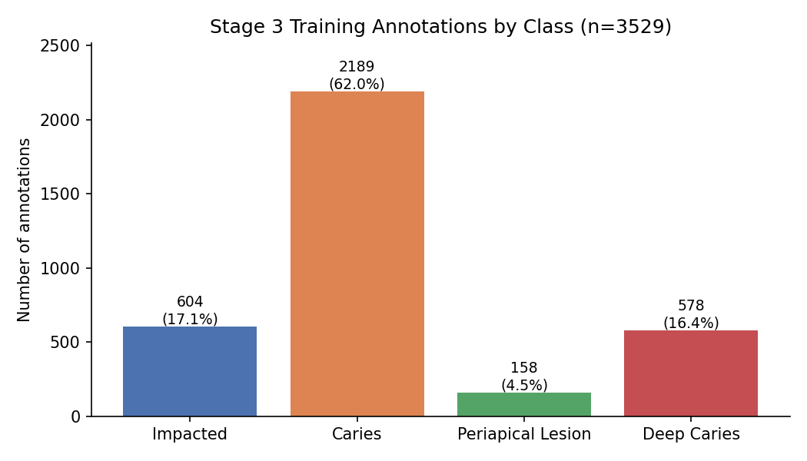
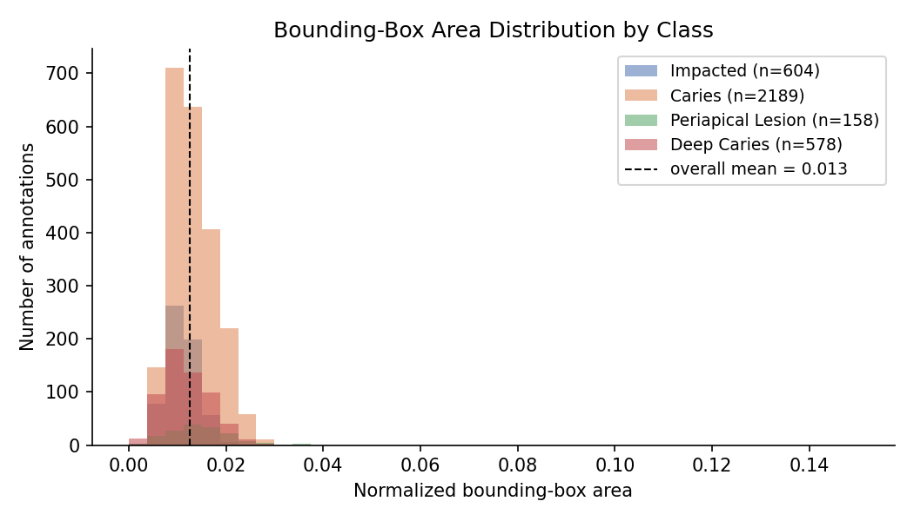
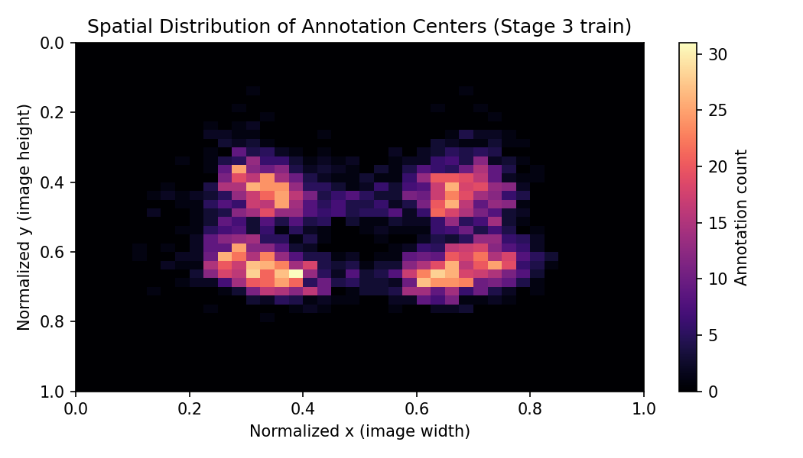
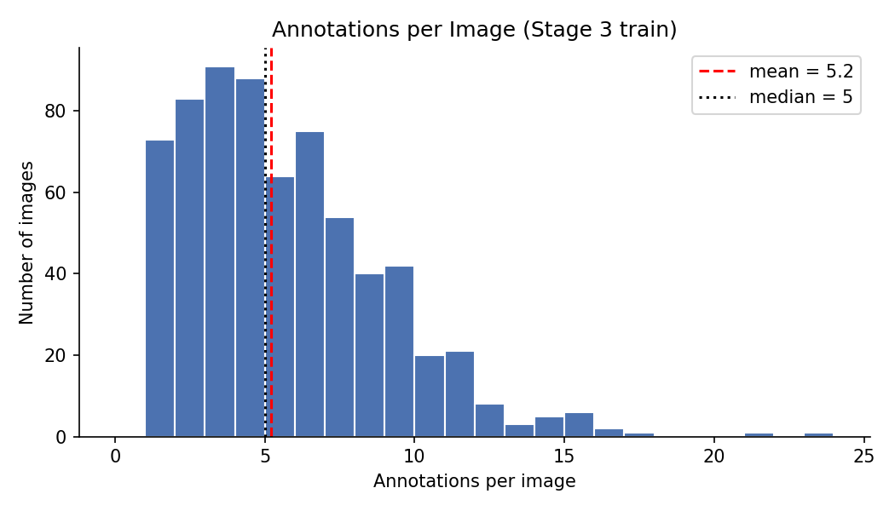
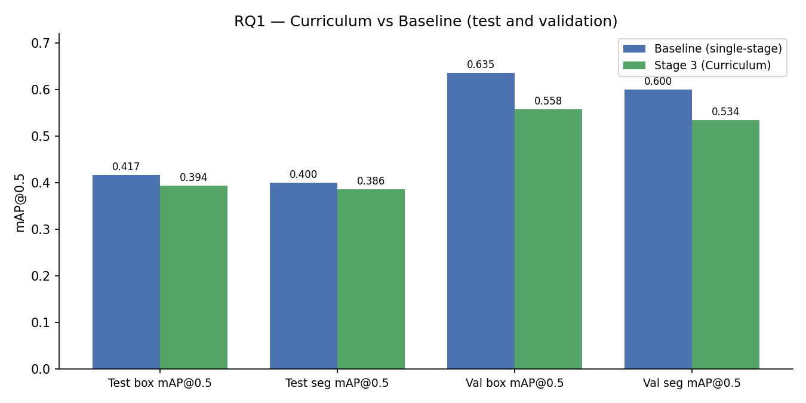
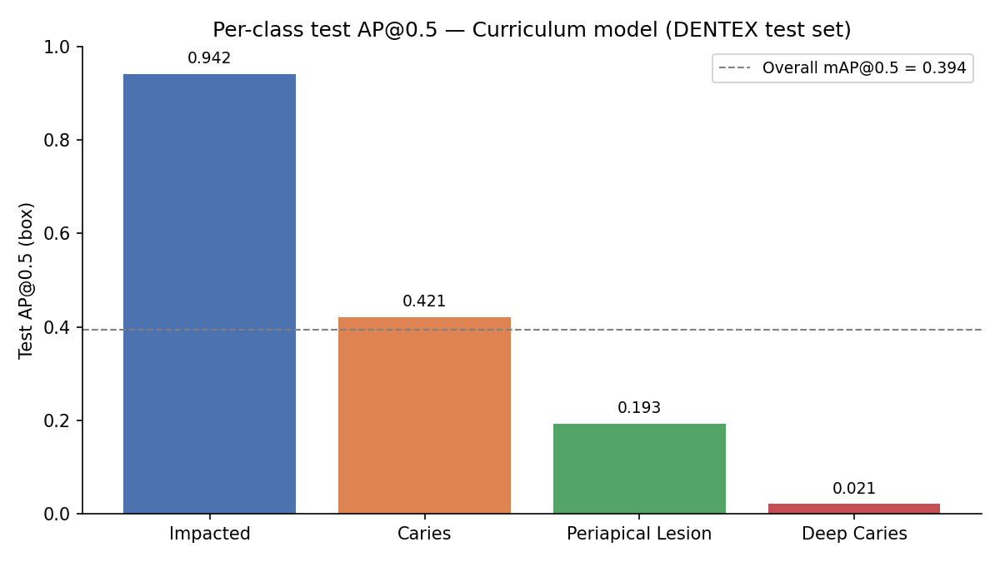

# Introduction and Literature Review

Dental disease is one of the most common chronic conditions worldwide, and panoramic radiography is the standard first-line imaging technique used to screen for it (Peres et al. 2019). A single panoramic X-ray typically contains 28 to 32 teeth, and clinicians must assess each of them individually for decay, periapical lesions, and other abnormalities. The task is repetitive, and the volume of panoramic X-rays taken in routine care is substantial. These two features together make panoramic-X-ray reading a natural target for automation.

Modern object-detection models have made rapid progress on this kind of problem. The YOLO family in particular has become the default baseline for medical-image detection because it is fast, well supported in open-source tooling, and produces both bounding-box and polygon-mask outputs in a single pass (Jocher et al. 2023). Recent work in dentistry has applied YOLO-family detectors to caries detection, periapical-lesion detection, and tooth-numbering tasks on both bitewing and panoramic X-rays (Hamamci et al. 2023a). A recurring concern in this literature is that dental disease classes are heavily imbalanced in naturally occurring data, and that fully labeled panoramic-X-ray datasets remain small relative to the number of distinct conditions a model is asked to detect.

The DENTEX 2023 benchmark, released as part of the MICCAI 2023 challenge (Hamamci et al. 2023a, Hamamci et al. 2023b), was designed in part to address this data-scarcity problem by providing annotations at three levels of detail. The release includes 693 X-rays labeled at the quadrant level only, 634 X-rays labeled with quadrant plus tooth position within the quadrant, and 705 X-rays labeled with full diagnosis codes, plus 1,571 unlabeled images intended for pretraining. The workflow described in the original challenge paper trained a hierarchical detector only on the fully labeled tier, treating the coarser tiers as auxiliary data that could be brought in through custom multi-task heads if participants chose. The challenge's baseline method, HierarchicalDet, followed that approach.

This design choice has a cost. By training only on the 705 fully labeled images, a single-stage model sees less than 35% of the labeled data that DENTEX actually provides. The coarser labels encode useful structure. A model that first learns to localize quadrants should have an easier time learning tooth positions, and a model that has learned tooth positions should be better placed to assign disease classes to the correct tooth. The general idea that easier-to-harder training schedules can improve a model's final performance has a long history in machine learning, going back to the original formulation of curriculum learning (Bengio et al. 2009), and has been revisited multiple times in the medical-imaging context.

Two concerns naturally follow. First, whether an easy-to-hard curriculum on DENTEX actually improves disease-level detection compared with a matched single-stage baseline that uses the fully labeled tier alone. If the extra supervision in the first two stages does not carry forward to the final task, then the additional labeled images are not functioning as a useful prior, and the curriculum is largely overhead. Second, whether the curriculum's contribution is concentrated in a particular stage. If most of the useful representation is learned in the quadrant stage, for example, that has different implications for dataset design than if most of it is learned in the enumeration stage.

This paper addresses those concerns directly. We train a three-stage curriculum YOLOv8m segmentation model on the DENTEX 2023 release and compare it, under matched hyperparameters, with a single-stage baseline trained only on the fully labeled tier. We also examine the checkpoints produced at each stage of the curriculum to isolate which stage contributes the most to the final model. A parallel track of the project, led by a co-author, evaluates how the resulting model behaves under realistic image degradations and across different anatomical scales of input. Those tasks are reported separately in this paper as Research Questions 3 and 4.

The four research questions are listed below.

1. *RQ1.* Does a three-stage curriculum (quadrant → enumeration → diagnosis) improve DENTEX disease-detection performance over a matched single-stage baseline trained only on the fully labeled tier?
2. *RQ2.* Which curriculum stage contributes most to the final model's performance?
3. *RQ3.* To what extent do realistic image degradations such as blur, noise, and motion reduce detection performance, and can augmentation with these degradations improve robustness? *[Addressed separately by co-author.]*
4. *RQ4.* To what extent does region-focused preprocessing at different anatomical scales improve detection performance relative to using the full panoramic image? *[Addressed separately by co-author.]*

The primary goal of this project is empirical rather than methodological. We do not propose a new architecture or a new curriculum algorithm. Instead, we evaluate how well a standard, widely used detection model responds to an explicit easy-to-hard curriculum when the curriculum is built using data that has already been released alongside the target task, and we report the result honestly regardless of its direction.

# Data Collection

## Source and scope

All data come from the DENTEX 2023 release (Hamamci et al. 2023a), a panoramic-X-ray benchmark assembled from three different clinical institutions and annotated under the FDI (Fédération Dentaire Internationale) tooth-numbering system. DENTEX is distributed as a single archive containing four sub-directories that correspond to its annotation tiers, each with its own annotation format and image pool. The four relevant sub-directories are as follows.

- `quadrant/` (Tier 1) holds 693 panoramic X-rays with quadrant-only labels (classes 0–3, corresponding to FDI quadrants 1–4).
- `quadrant_enumeration/` (Tier 2) holds 634 panoramic X-rays labeled with quadrant plus tooth position within the quadrant (classes 0–7, FDI tooth positions 1–8).
- `quadrant-enumeration-disease/` (Tier 3) holds 705 panoramic X-rays labeled with quadrant, tooth position, diagnosis class, and polygon segmentation mask.
- `unlabelled/` holds 1,571 panoramic X-rays with no annotations.

Tiers 1 and 2 are distributed in COCO format with one JSON file per tier. Tier 3 is also COCO-formatted but uses three separate category fields (`category_id_1`, `category_id_2`, `category_id_3`) to encode quadrant, tooth, and diagnosis respectively, and includes polygon segmentation information. The DENTEX test set of 250 panoramic X-rays is distributed in LabelMe format, with one JSON file per image and with labels written as Turkish-language strings of the form `"1-çürük-36"` (`quadrant`-`disease`-`FDI-tooth-number`).

We used the full Tiers 1–3 collection for training and validation, and the 250-image LabelMe test set for final evaluation. The 1,571 unlabeled images were not used in this paper.

## Eligibility and filtering

No participant-level filtering applies to this dataset because DENTEX is an image collection rather than a participant-level survey. The only data-cleaning step that removed records was on the test set. Of the 1,600 test-annotation instances distributed across the 250 test images, 131 contained label strings that did not map to any of the four DENTEX diagnosis classes. These were `saglam` ("healthy"), `çekim` ("extraction"), and `kırık` ("broken"). These categories are not part of the training label set, and treating them as any of the four valid classes would inject systematic label noise into the evaluation. They were dropped from the test labels prior to scoring, leaving 1,469 evaluable tooth-level annotations.

## Annotation structure and target classes

The final modeling target is the four DENTEX disease classes. These are Impacted (obstructed eruption), Caries (early decay), Periapical Lesion (infection at the root tip), and Deep Caries (advanced decay approaching the pulp). Class indices 0–3 correspond to these four categories in the order in which they appear in the DENTEX category list.

For the curriculum stages, two intermediate target sets are used. Stage 1 targets are the four quadrants (class IDs 0–3). Stage 2 targets are the eight tooth positions within a quadrant (class IDs 0–7). Stage 3 targets are the four disease classes described above. The hierarchical relationship between the three target sets is exactly the relationship that motivates the curriculum. A detection at Stage 3 corresponds to a specific tooth within a specific quadrant and with a specific diagnosis, and each of those three pieces of information is supervised independently at some point in the pipeline.

For convenience, @tbl-runs summarizes the three curriculum stages together with the single-stage baseline referenced throughout the rest of the paper.

| Run | Training images | Classes | Warm-start | Role |
| --- | --- | --- | --- | --- |
| Stage 1 (Quadrant) | 1,398 (693 Tier 1 + 705 Tier 3) | 4 (quadrants) | ImageNet | Curriculum foundation |
| Stage 2 (Enumeration) | 1,339 (634 Tier 2 + 705 Tier 3) | 8 (tooth positions) | Stage 1 best | Curriculum middle |
| Stage 3 (Curriculum) | 705 (Tier 3 only) | 4 (diseases) | Stage 2 best | Curriculum final |
| Baseline | 705 (Tier 3 only) | 4 (diseases) | ImageNet | Comparison for RQ1 |

: Quick reference for the four training runs evaluated in this paper. All four produce YOLOv8m-seg checkpoints. Stage 3 (Curriculum) and Baseline are directly compared in RQ1, and all three curriculum stages are compared against each other in RQ2. {#tbl-runs}

## Preprocessing and conversion to YOLO format

Raw DENTEX annotations are not in a YOLO-compatible format, so the first pipeline step converts them. The full conversion chain is implemented in three scripts (`scripts/01_convert_training_to_yolo.py`, `scripts/02_convert_test_to_yolo.py`, and `scripts/03_generate_yamls.py`) and produces, for each of the three curriculum stages, a directory tree containing normalized YOLO `.txt` label files and symlinked images under `data/processed/stage{1,2,3}_*/images/{train,val,test}` and `labels/{train,val,test}`, plus a per-stage dataset YAML file under `data/processed/yamls/`.

Three preprocessing decisions deserve explicit attention. First, polygon segmentation masks were preserved in the label files for Stage 3, so the final curriculum stage and the baseline both produce instance-segmentation outputs in addition to bounding boxes. This matches the DENTEX test-set annotation format, which also includes polygon masks. Second, for Stages 1 and 2, where the coarser label schema is a strict superset of what Tier 3 images are annotated for, Tier 3 images were included in the training pool by extracting only the relevant coarse labels (`category_id_1` for Stage 1 and `category_id_2` for Stage 2). This choice is what allows Stage 1 and Stage 2 to see approximately twice the training data available to a naive single-stage model. Third, the 131 unmappable test-set annotations described above were dropped during the LabelMe-to-YOLO conversion in `02_convert_test_to_yolo.py` rather than being silently assigned to a default class, and the script logs the number of dropped annotations at run time.

# Exploratory Data Analysis

Before training any detectors, we first examined the training data to understand its class composition, spatial structure, and object-size distribution. The patterns that emerge from that exploration motivate several of the modeling choices described in the following section.

## Class distribution

At the disease level, the four DENTEX training classes are badly imbalanced. Across the 3,529 annotations in the 705 Stage 3 training images (of which 678 carried at least one labeled disease instance), Caries is by far the most common class. Impacted is the next most common and corresponds to a visually very distinct shape (third molars that fail to erupt). Periapical Lesion appears considerably less often, and Deep Caries is rare. The frequency ratio between the most and least common classes is roughly 14 to 1 (@fig-class-dist). This imbalance is more severe than the class ratios alone suggest, because the rare classes also tend to be smaller objects and to appear in fewer spatial positions, both of which compound the difficulty of learning them from a fixed number of training boxes.

{#fig-class-dist width=85%}

The class distribution at the quadrant and enumeration stages is much more uniform. Every image contains multiple quadrants and multiple teeth, so the per-image label budget for Stages 1 and 2 is an order of magnitude larger than for Stage 3. This asymmetry is an important feature of the curriculum. The earlier stages are not only on larger image pools, they also produce more labels per image, which drives a much stronger and more stable training signal at those stages than at the final one.

## Bounding-box size

Bounding boxes in DENTEX are small in normalized coordinates, with a mean area of roughly 1.3% of the full image (@fig-bbox-area). The distribution is right-skewed. Most teeth occupy a small fraction of the panoramic view, and the largest boxes correspond to impacted third molars with surrounding structures or to pathologies that span multiple adjacent teeth. Class-conditional differences are modest. Impacted boxes are on average slightly larger than Caries or Deep Caries boxes, consistent with the fact that impacted third molars typically occupy more image area than a decayed surface on a single tooth.

{#fig-bbox-area width=85%}

## Spatial structure

The spatial distribution of annotated objects in the training set reflects the anatomical structure of a panoramic radiograph. Annotations cluster in the left and right regions of the image (corresponding to the left and right dental arches) and are sparse near the vertical midline (@fig-spatial). Within each side, detections are distributed along a smooth arc that traces the mandibular and maxillary dentition. This is the structural feature that makes region-focused preprocessing worth evaluating separately in RQ4.

{#fig-spatial width=85%}

## Objects per image

The number of disease annotations per image is also right-skewed, with a mean of 5.2 disease instances per annotated image, a median of 4, and a maximum of 23 (@fig-objects-per-image). For the quadrant and enumeration tiers the label budget is anatomy-wide rather than pathology-wide and climbs considerably higher per image. Together, the small absolute size of the objects and the modest-to-high objects-per-image count mean that the loss surface for Stage 3 is dominated by a large number of small positives against a larger negative background. This is one of the conditions under which detector training is known to be hard (Lin et al. 2017), and it is part of the reason small datasets at this scale often benefit more from strong augmentation than from architectural changes.

{#fig-objects-per-image width=85%}

# Methods

## Model

The underlying detector for all runs is YOLOv8m-seg (Jocher et al. 2023), the medium-capacity variant of the YOLOv8 family that supports instance segmentation with polygon mask outputs. YOLOv8m-seg was selected because it is directly supported by the Ultralytics package, runs efficiently on both Apple Silicon MPS and CUDA GPUs, and produces segmentation masks natively without requiring a separate mask head or post-processing stage. All four runs (Stage 1, Stage 2, Stage 3 Curriculum, and Baseline) use the same architecture and the same pretrained ImageNet backbone at initialization.

## Curriculum training framework (RQ1 and RQ2)

The curriculum is implemented as a sequence of three fine-tuning runs in which the best checkpoint from the previous stage becomes the initialization for the next. All three stages use AdamW as the optimizer, a cosine learning-rate schedule with final-LR factor `lrf = 0.01`, weight decay `5 × 10⁻⁴`, dropout 0.0, and mosaic augmentation at full strength. Stages differ primarily in their learning rate, warm-up length, and input data, as detailed below.

- Stage 1 (Quadrant detection). Initialized from ImageNet. Trains on 1,398 images (693 Tier-1 plus 705 Tier-3 at the quadrant level), targets four quadrant classes, `lr0 = 1 × 10⁻³`, 3 warm-up epochs, batch size 8, 100 epochs, early-stopping patience 20. Augmentation is moderate (`hsv_s = hsv_v = 0.3`, `fliplr = 0.5`, `flipud = 0.1`, `mosaic = 1.0`).
- Stage 2 (Tooth enumeration). Initialized from the best Stage 1 checkpoint. Trains on 1,339 images (634 Tier-2 plus 705 Tier-3 at the enumeration level), targets eight tooth-position classes, `lr0 = 5 × 10⁻⁴`, 2 warm-up epochs, batch size 4, 100 epochs, early-stopping patience 20, AMP disabled.
- Stage 3 Curriculum (Diagnosis). Initialized from the best Stage 2 checkpoint. Trains on the 705 Tier-3 images, targets four diagnosis classes, `lr0 = 3 × 10⁻⁴`, 2 warm-up epochs, batch size 8, 100 epochs, early-stopping patience 25. Augmentation is slightly stronger than Stage 1 (`hsv_s = hsv_v = 0.4`, `copy_paste = 0.1`) to compensate for the smaller training pool.

Two implementation details affected training stability at Stage 2 and are worth noting. First, the Ultralytics Task-Aligned Learning (TAL) assigner occasionally crashed with a shape-mismatch error at line 195 of `tal.py` (`bbox_scores[mask_gt] = pd_scores[ind[0], :, ind[1]][mask_gt]`). The failure pattern is sporadic and is more frequent under AMP on the MPS backend. Two mitigations were applied. First, `mask_gt` is cast to a boolean tensor before being indexed into, which removes the float-mask advanced-indexing edge case. Second, if a batch still crashes inside the assigner, that batch's `align_metric` and `overlaps` are returned as zeros so that TAL assigns no positives and the batch contributes effectively zero loss instead of terminating the run. In addition, `amp=False` and `batch=4` were used at Stage 2 after initial `amp=True, batch=8` runs crashed at epoch 12. Both changes reduced peak MPS memory from 10.6 GB to 6.3 GB and the crash did not recur.

## Baseline (RQ1 comparator)

The baseline for RQ1 is a single-stage run matched as closely as possible to Stage 3 so that any performance difference can be attributed to the presence of the curriculum warm-start rather than to hyperparameter drift. The baseline trains on the same 705 Tier-3 images, with the same YOLOv8m-seg architecture, the same AdamW optimizer, and the same augmentation schedule as Stage 3. The two differences are the initialization (ImageNet instead of Stage 2's checkpoint) and the initial learning rate (`lr0 = 1 × 10⁻³` instead of `3 × 10⁻⁴`). The initial-LR difference is not a confound introduced for convenience. Stage 3 uses a lower LR because it is the final fine-tuning stage of a warm-started model and would overshoot at `lr0 = 1 × 10⁻³`. Other optimizer choices (weight decay, learning-rate schedule, warm-up shape) are identical across the two runs.

## *[Placeholder for methods for RQ3 (image robustness), to be completed by co-author.]* {.unnumbered}

## *[Placeholder for methods for RQ4 (region-focused preprocessing), to be completed by co-author.]* {.unnumbered}

## Evaluation protocol

All curriculum and baseline models are evaluated on the held-out DENTEX validation set (50 panoramic X-rays) during training and on the DENTEX test set (250 panoramic X-rays, 1,469 evaluable annotations after filtering) for final reporting. The validation set is used for picking the best checkpoint inside each training run. The test set is used only once, after all hyperparameters and stopping criteria have been fixed, to avoid leaking test-set information into model selection.

Two standard metrics are reported on both sets. Mean average precision at IoU 0.5 (mAP\@0.5) summarizes performance at a single, relatively forgiving overlap threshold and is the headline metric used in the DENTEX challenge. Mean average precision averaged over IoU thresholds from 0.5 to 0.95 in steps of 0.05 (written mAP\@0.5-0.95) summarizes performance across a range of localization strictness. Both metrics are computed for bounding boxes and for segmentation masks, the two output modalities produced by YOLOv8m-seg. We report mAP\@0.5 as the primary metric because it is most directly comparable to the DENTEX challenge baselines and because it is more stable under small test sets than mAP\@0.5-0.95. For RQ2, which compares the three curriculum stages against each other, we also report per-stage validation mAP at the stage's own target space (four-class quadrant mAP for Stage 1, eight-class enumeration mAP for Stage 2, and four-class diagnosis mAP for Stage 3). These quantities are not directly comparable in absolute terms because they measure different prediction spaces, but the trajectory of how much mAP is achieved at each stage is informative about where the curriculum's capacity is being built.

# Results

## Sample description

The final working corpus comprised 1,398 training images at Stage 1, 1,339 at Stage 2, and 705 at Stage 3, with 50 validation images and 250 test images used identically across runs. Within the 705 fully labeled Tier-3 training images, 678 carried at least one disease annotation, for a total of 3,529 disease instances in the Stage 3 and baseline training pool (mean 5.2 annotations per annotated image). After removing the 131 unmappable test annotations, the test set contained 1,469 evaluable disease instances distributed across the four DENTEX classes.

@fig-training-curves reports validation mAP\@0.5 per training epoch for all three comparable runs (Baseline, Stage 2, and Stage 3 Curriculum). The three trajectories converge on a similar ceiling for box detection, and the Stage 3 curriculum run does not overshoot the baseline's final mAP at any point. This visual already previews the RQ1 result reported below.

{#fig-training-curves width=95%}

## RQ1. Curriculum versus single-stage baseline

The headline comparison is between the final curriculum checkpoint (Stage 3, warm-started from Stage 2) and the matched single-stage baseline (ImageNet-initialized). Both are trained on the same 705 Tier-3 disease images, use the same YOLOv8m-seg architecture, the same AdamW optimizer, and the same augmentation schedule, and both are evaluated with identical code on the DENTEX 50-image validation set (used for picking the best checkpoint) and 250-image test set (used once, at the end). @tbl-rq1 reports the best-epoch values for each model.

| Model | Val box mAP\@0.5 | Val seg mAP\@0.5 | Val box mAP\@0.5-0.95 | Val seg mAP\@0.5-0.95 | Test box mAP\@0.5 | Test seg mAP\@0.5 |
| --- | --- | --- | --- | --- | --- | --- |
| Baseline (single-stage) | 0.635 | 0.600 | 0.415 | 0.374 | 0.417 | 0.400 |
| Stage 3 (Curriculum) | 0.558 | 0.534 | 0.371 | 0.355 | 0.394 | 0.386 |
| Δ (Baseline − Curriculum) | +0.077 | +0.066 | +0.044 | +0.019 | +0.023 | +0.014 |

: Validation and test performance for the final curriculum stage (Stage 3) and the matched single-stage baseline, best-epoch values on the 50-image DENTEX validation set and the 250-image test set. All four disease classes scored jointly. The baseline is ahead of the curriculum on every metric and at both IoU thresholds. {#tbl-rq1}

The baseline is ahead of the curriculum on every metric in @tbl-rq1 (@fig-rq1-comparison). The test-set gap is modest in absolute terms (+0.023 box mAP\@0.5, +0.014 seg mAP\@0.5), but the direction is consistent across all six matched comparisons (box and segmentation, at IoU 0.5 and 0.5-0.95, on validation and on test). That uniformity is not compatible with the two models being equivalent on this data. The gap also widens at the stricter IoU 0.5-0.95 threshold on the validation set (+0.044 box), which indicates that the baseline produces tighter localizations and not just higher recall.

{#fig-rq1-comparison width=90%}

The curriculum does inherit a real but short-lived advantage from the Stage 2 warm-start. At training epoch 1 it reports 0.273 val box mAP\@0.5 against the baseline's 0.212, a +0.061 head start that reflects the Stage 2 backbone having already learned to fire on tooth-shaped regions. That advantage does not persist. By the best-val epoch (36 for baseline, 37 for curriculum, nearly identical), the baseline has overtaken the curriculum by 0.077 val box mAP and ends at a higher ceiling on every IoU threshold evaluated. The curriculum is also more expensive to train. The baseline reaches its best epoch in about 1 h 51 m (6,649 s), while Stage 2 and Stage 3 alone already consume around 4 h (14,290 s), and Stage 1 adds further training time on top.

Two mechanisms likely account for this outcome. The early-stage target spaces (quadrants at Stage 1, tooth positions at Stage 2) are primarily geometric rather than semantic. They teach the model where teeth are but not what caries look like, so the curriculum's extra supervision is largely unrelated to the final classification task. In addition, because the output class count changes at every curriculum transition (4 → 8 → 4), the classification head has to be reinitialized at each boundary. Only the backbone and neck actually transfer, and the Stage 3 head is learned essentially from scratch against the same 705-image label pool the baseline sees. The one asymmetry that slightly favors the curriculum is that it loses less mAP from validation to test (29% relative decline versus 34% for the baseline), which suggests its representation carries across the jump from validation data to test data slightly better. The absolute test numbers still favor the baseline, so the practical picture does not change.

## RQ2. Which stage contributes most

The curriculum is a sequence of three training phases, each with its own target space, training-image pool, and annotation density. RQ2 asks where, if anywhere, the useful part of the curriculum's representation is being built. Two breakdowns are needed to answer that, because the three stages are not on a shared mAP scale. @tbl-rq2a reports the stages' peak validation mAPs on their own target spaces, and @tbl-rq2b reports the training-signal volume (total number of annotated boxes) each stage exposes the model to.

| Stage | Target space | Train images | Best val mAP\@0.5 (box) | Peak epoch |
| --- | --- | --- | --- | --- |
| Stage 1 | Quadrant (4 classes) | 1,398 | not archived | not archived |
| Stage 2 | Tooth enumeration (8 classes) | 1,339 | 0.435 | 18 of 44 |
| Stage 3 (Curriculum) | Disease (4 classes) | 705 | 0.558 | 37 of 68 |
| Baseline | Disease (4 classes) | 705 | 0.635 | 36 of 79 |

: Best validation mAP\@0.5 (box) at each stage on that stage's own target space, plus the baseline for context. These per-stage values are *not* directly comparable, because each stage is predicting a different thing over a different number of classes. The correct reading is the overall *profile* rather than a ranking. Stage 1's `results.csv` was not archived in the version of the project that was recovered, so its per-epoch numbers cannot be recomputed here. {#tbl-rq2a}

| Stage | Annotated images | Boxes | Boxes per annotated image | Class imbalance (max to min) |
| --- | --- | --- | --- | --- |
| Stage 1 | 1,371 | 6,301 | 4.6 | 1.1 to 1 (very balanced) |
| Stage 2 | 1,312 | 21,624 | 16.5 | 1.3 to 1 (balanced) |
| Stage 3 (Curriculum / Baseline) | 678 | 3,529 | 5.2 | 13.9 to 1 (severely imbalanced) |

: Training-signal volume at each stage of the curriculum, measured directly from the YOLO label files produced by the preprocessing pipeline. The curriculum's total training-signal volume (Stages 1 + 2 + 3 = 31,454 boxes) is 8.9× the volume the baseline sees from its 3,529 Tier-3 boxes, but most of that extra volume (21,624 boxes, or 69% of the curriculum total) comes from Stage 2. {#tbl-rq2b}

{#fig-rq2-stages width=90%}

Most of the curriculum's extra supervision is concentrated at Stage 2, which sees 21,624 annotated tooth-position boxes. That is 6.1× what Stage 3 sees and 3.4× what Stage 1 sees, for 69% of the curriculum's 31,454-box total. Stage 1 is spatially coarse (roughly one box per dental quadrant) and Stage 3 is its own small training pool, so if the curriculum gives Stage 3 any useful head start, the bulk of it has to come through the Stage 2 backbone. This matches the epoch-1 observation from RQ1. The curriculum begins training at 0.273 val mAP because Stage 2 has already tuned the backbone to fire on tooth-shaped image regions.

But the extra supervision does not translate into a higher ceiling. Stage 3 (curriculum) peaks at 0.558 val box mAP\@0.5 on the four-class disease task, while the baseline peaks at 0.635 on the same task from only ImageNet initialization. Even after 8.9× the annotated-box volume across the full curriculum, the warm-started model reaches a lower ceiling than the cold-started model does on 705 images alone. The apparent drop from Stage 2 (0.435) to Stage 3 (0.558) in @tbl-rq2a is not a sign that capacity is being lost. Stage 2 predicts eight tooth-position classes on 16.5 boxes per image, while Stage 3 predicts four disease classes on 5.2 boxes per image with a 13.9 to 1 class imbalance, so the two values measure different tasks at different difficulties and cannot be directly compared.

Reading the two tables together, the capacity-building stage is solving the wrong problem for the downstream task. Stage 2 is where both the box volume and the backbone shaping are concentrated, and it is also the stage whose target, tooth identity under FDI numbering, is least aligned with the Stage 3 disease target. The YOLOv8m-seg classification head is reinitialized at every curriculum transition (4 → 8 → 4 outputs with different class meanings), so only the backbone and neck actually transfer. The Stage 3 head is still learned from scratch on the same 705-image, 13.9 to 1 imbalanced label pool the baseline faces, which is the real limit in both runs.

## Per-class performance on the test set

@tbl-per-class decomposes the curriculum's test-set box mAP\@0.5 by diagnosis class. The difference between classes is larger than the difference between the curriculum and baseline models.

| Class | Test AP\@0.5 (box) |
| --- | --- |
| Impacted | 0.942 |
| Caries | 0.421 |
| Periapical Lesion | 0.193 |
| Deep Caries | 0.021 |

: Per-class test-set AP\@0.5 (box) for the curriculum model. Impacted is nearly at the ceiling, and Deep Caries is essentially not learned at this sample size. {#tbl-per-class}

Impacted teeth are easy. They are visually distinctive (unerupted third molars with a characteristic orientation), they tend to appear in predictable locations, and they are well represented in training. At the other extreme, Deep Caries is close to a failure case. It is the rarest class in training, its appearance overlaps substantially with the Caries class from which it is normally told apart by how deeply decay has penetrated into the pulp, and the model has essentially no capacity left over after the more common classes have been fit. Caries and Periapical Lesion fall between these two extremes. The overall mAP\@0.5 of 0.394 is, in that sense, an average over one nearly-solved class, two partially-solved classes, and one almost-unsolved class.

{#fig-per-class-ap width=90%}

This per-class profile (@fig-per-class-ap) is also relevant to RQ1. Because the curriculum-versus-baseline gap is small in absolute terms (0.02 mAP), and because the per-class spread is an order of magnitude larger, any intervention that improves Deep Caries or Periapical Lesion by even a modest amount would produce a larger overall change than the curriculum intervention itself. This is a useful ranking for deciding where to spend additional effort.

## Confusion structure

The AP numbers collapse a lot of behavior into a single scalar per class, so we also look at the validation-time normalized confusion matrices for the two models (@fig-confusion). The matrices make the trade-off in the curriculum run more legible than the AP table does. Under both models, the Impacted class is close to the ceiling. The true-positive rate sits at 0.90, with the remaining mass going to the background row rather than to another disease class. The curriculum run nudges the Caries recall upward (0.47 → 0.51) and reduces the rate at which the background is labeled as caries (0.49 → 0.42). But that improvement is bought at a cost on the two rarer lesion classes. The Periapical Lesion true-positive rate falls from 0.44 in the baseline to 0.22 in the curriculum run, and Deep Caries falls from 0.50 to 0.34. In both models, the Caries, Deep Caries, and Periapical Lesion block is substantially off-diagonal. When the model does fire on one of these classes, it is nearly as likely to swap identities as to get the class right. The curriculum does not eliminate that swapping. If anything, it redistributes recall toward the most common disease class at the expense of the two rarer ones. This is consistent with the "capacity built at Stage 2" explanation in the Discussion. The representation inherited from the 8-class enumeration task transfers well for the classes that dominate the feature space (Impacted, Caries), but the fine-grained discrimination needed for the rarer lesion classes still has to be re-learned at Stage 3 on 705 images, which is the same constraint the baseline faces.

{#fig-confusion width=100%}

## Qualitative predictions

@fig-predictions shows six representative test-set predictions from the curriculum model. The common failure modes visible in these examples match the quantitative profile above. Impacted third molars are reliably localized and classified. Superficial caries on anterior teeth are usually detected but sometimes misclassified between Caries and Deep Caries. Periapical lesions near root tips are sometimes missed entirely when the surrounding bone texture is low-contrast. No sample was selected adversarially, and the six shown are a stratified draw across the four classes.

{#fig-predictions width=95%}

## [Placeholder for RQ3]

## [Placeholder for RQ4]

## Cross-task consistency

One of the clearer findings across both RQ1 and RQ2 is that the most important limits on final performance are not the ones targeted by the curriculum. Whether the model is warm-started from ImageNet or from Stage 2, its ranking of class difficulty is essentially unchanged. Impacted is easy, Deep Caries is hard, and the middle two are middle. This mirrors the pattern reported for the DENTEX baseline method (Hamamci et al. 2023b) and suggests that at the current sample size, the dominant source of error is not the quality of the shared representation but the label sparsity of individual disease classes.

# Discussion

Under matched hyperparameters, the three-stage curriculum did not improve disease detection on DENTEX, and the negative direction is consistent across all six matched comparisons (test and validation, box and segmentation, mAP\@0.5 and mAP\@0.5-0.95). That the baseline also reaches its best checkpoint in a shorter total schedule, and at roughly half the total training time of the full curriculum, reinforces the point. The most plausible interpretation is that both models hit a ceiling set by the 705-image, 13.9 to 1 imbalanced Tier-3 training pool, and the curriculum's extra supervision does not move that ceiling upward despite giving the model a measurable epoch-1 head start.

The mechanism behind that outcome is visible in the per-stage breakdown. Stage 2 contributes 21,624 of the curriculum's 31,454 annotated training boxes (69% of the total) and is the last backbone update before the diagnosis task begins. But Stage 2's target is eight-class tooth position, a geometric FDI numbering property rather than a pathology property. The curriculum therefore builds the most representation on the stage whose labels are least predictive of the Stage 3 disease classes. Training-signal volume is not the real limit here. The baseline sees 8.9× less labeled data and still wins. What limits Stage 3 is the disease-label distribution. There are four classes with a 13.9 to 1 ratio between the most and least common, and a rare class (Deep Caries, 158 boxes) whose appearance overlaps with a common class (Caries, 2,189 boxes). No amount of Stage 1 or Stage 2 supervision relaxes that. Consistent with this, the per-class spread on the test set (0.94 for Impacted down to 0.02 for Deep Caries) is an order of magnitude larger than the curriculum-versus-baseline spread (0.02), which suggests that future work on DENTEX will be better served by class-level interventions (class-balanced sampling, focal-style loss weights, synthetic Deep Caries augmentation) than by further curriculum engineering.

Limitations. We did not repeat training runs to estimate run-to-run noise directly. Any single one of the six matched comparisons in isolation would be compatible with noise, and the strength of the RQ1 conclusion therefore rests on the consistency of direction across comparisons rather than on a formal statistical test. All curriculum runs also share a single backbone (YOLOv8m-seg) and a single family of hyperparameters, so a curriculum that does not help under these settings might still help under a different model family or augmentation recipe. Finally, Stage 2 training was affected by a known Ultralytics TAL crash that forced a reduction from AMP at batch size 8 to no AMP at batch size 4, and Stage 1's `results.csv` was not archived in the recovered project state, so a better-tuned curriculum might produce a stronger Stage 2 backbone than the one actually used.

# Conclusion

Three findings stand out from the curriculum-learning track. First, a three-stage easy-to-hard curriculum trained on the full DENTEX 2023 release did not outperform a matched single-stage baseline. The baseline was ahead across all six matched comparisons (test and validation, box and segmentation, both IoU thresholds), with the test-set box mAP\@0.5 gap at +0.023 in the baseline's favor. Second, the curriculum does inherit a short-lived warm-start advantage (+0.061 val box mAP at epoch 1) from the Stage 2 backbone, but that advantage is spent by the best-val epoch (around epoch 36 for both models), after which the curriculum trains to a lower ceiling. Third, 69% of the curriculum's 8.9× extra annotated-box volume is concentrated at Stage 2, whose tooth-position target space overlaps with disease classification in space but not in meaning, so the supervision volume is large but off-target for what the final classifier needs. Taken together, these results suggest that on datasets of DENTEX's scale, class imbalance and the intrinsic difficulty of particular diseases are larger limits than the total number of labeled boxes, and that curricula built from the label tiers a dataset happens to release do not automatically improve fine-grained detection.

The robustness (RQ3) and region-focused-preprocessing (RQ4) tracks of this project are reported separately by the co-author and provide complementary evidence on how the model behaves under controlled distribution shift and across different anatomical scales of input.

# References {.unnumbered}

Bengio, Yoshua, Jérôme Louradour, Ronan Collobert, and Jason Weston. 2009. "Curriculum Learning." In *Proceedings of the 26th Annual International Conference on Machine Learning*, 41–48.

Hamamci, Ibrahim Ethem, Sezgin Er, Enis Simsar, Atif Emre Yuksel, Sadullah Gultekin, Serife Damla Ozdemir, Kaiyuan Yang, Hongwei Bran Li, Sarthak Pati, Bernd Stadlinger, Albert Mehl, Mustafa Gundogar, and Bjoern Menze. 2023a. "DENTEX. An Abnormal Tooth Detection with Dental Enumeration and Diagnosis Benchmark for Panoramic X-rays." *arXiv preprint* arXiv:2305.19112.

Hamamci, Ibrahim Ethem, Sezgin Er, and Bjoern Menze. 2023b. "Diffusion-Based Hierarchical Multi-Label Object Detection to Analyze Panoramic Dental X-rays." In *Medical Image Computing and Computer Assisted Intervention – MICCAI 2023*. Springer.

Jocher, Glenn, Ayush Chaurasia, and Jing Qiu. 2023. "Ultralytics YOLOv8." <https://github.com/ultralytics/ultralytics>.

Lin, Tsung-Yi, Priya Goyal, Ross Girshick, Kaiming He, and Piotr Dollár. 2017. "Focal Loss for Dense Object Detection." In *Proceedings of the IEEE International Conference on Computer Vision*, 2980–2988.

Peres, Marco A., Lorna M. D. Macpherson, Robert J. Weyant, Blánaid Daly, Renato Venturelli, Manu R. Mathur, Stefan Listl, et al. 2019. "Oral Diseases. A Global Public Health Challenge." *The Lancet* 394 (10194), 249–60.
